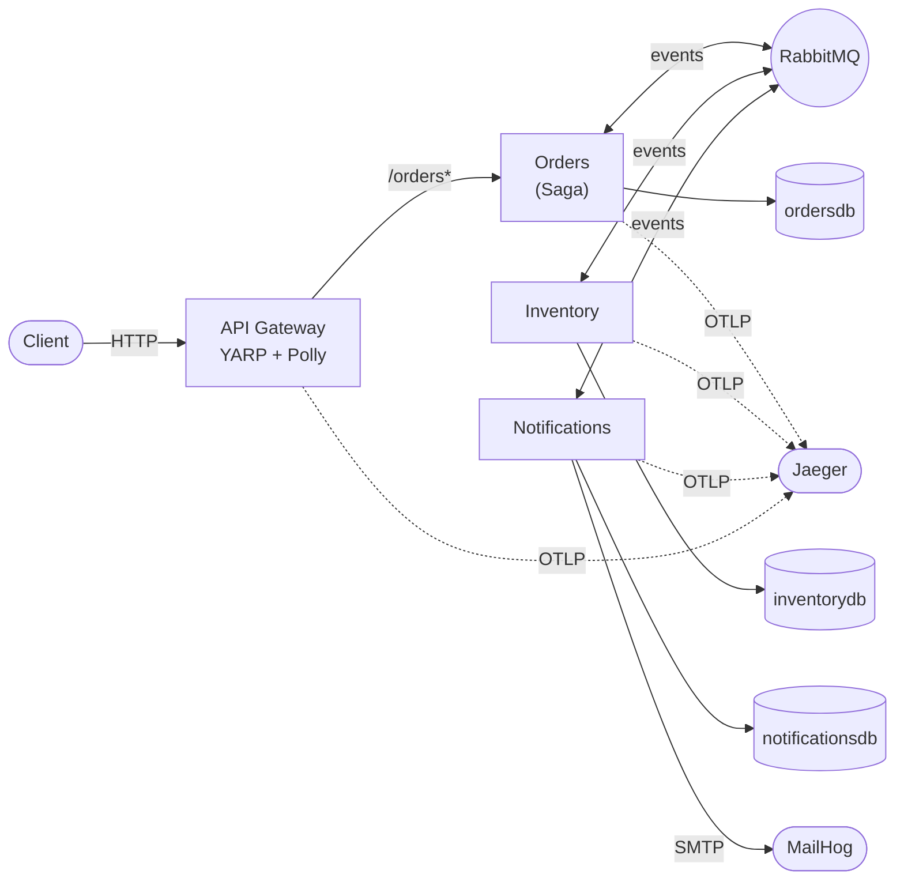

# OrderFlow

Микросервисная система обработки заказов на **.NET 9**, демонстрирующая production-паттерны распределённых систем: **Saga-оркестрацию**, транзакционный **Outbox**, идемпотентность, распределённую трассировку, resilience и интеграционные тесты на **Testcontainers**.

Клиент создаёт заказ через API Gateway → сага координирует резервирование товара на складе → при успехе заказ подтверждается и клиенту уходит письмо, при нехватке товара заказ отменяется (с компенсацией). Всё межсервисное взаимодействие — асинхронное, через RabbitMQ; у каждого сервиса своя БД.

> Полный разбор архитектуры с диаграммами — в [docs/architecture.md](docs/architecture.md). ТЗ и план — в [docs/tz.md](docs/tz.md) и [docs/plan.md](docs/plan.md).

## Что внутри

| Возможность | Как реализовано |
|---|---|
| **Saga-оркестрация** | MassTransit State Machine, состояние в БД (EF Core saga repository, пессимистичная блокировка) |
| **Компенсирующие транзакции** | ветка отказа + таймаут-компенсация (`ReleaseStock`), обработка опоздавших сообщений |
| **Transactional Outbox** | `AddEntityFrameworkOutbox` во всех сервисах — против dual-write |
| **Idempotency** | inbox-дедупликация по `MessageId` + бизнес-идемпотентность по `OrderId` |
| **Distributed tracing** | OpenTelemetry → Jaeger; один trace сквозь Gateway → Orders → Inventory → Notifications |
| **Resilience** | Polly (retry + circuit breaker) на health-хопах шлюза, независимый предохранитель на сервис |
| **API Gateway** | YARP — единая точка входа + агрегированный `/health` |
| **Тесты** | xUnit + Testcontainers (Postgres для репозиториев/подсистем, RabbitMQ + Postgres для саги) |

## Архитектура



**Поток заказа:** `POST /orders` → `OrderSubmitted` → сага шлёт `ReserveStock` → Inventory отвечает `StockReserved` / `StockReservationFailed` → сага публикует `OrderConfirmed` / `OrderCancelled` → Notifications отправляет письмо. Корреляция по `OrderId`.

## Стек

.NET 9 · ASP.NET Core Minimal API · MassTransit 8 (RabbitMQ) · EF Core 9 + Npgsql/PostgreSQL · YARP · Polly · OpenTelemetry + Jaeger · MailHog · xUnit + Testcontainers · Docker Compose

Внутри каждого сервиса — слоистая структура (`Entities → Repository → Systems`) по образцу репозитория `tat.domain`.

## Быстрый старт

Нужен **.NET 9 SDK** и **Docker**.

```bash
# 1. Поднять инфраструктуру (Postgres [3 БД], RabbitMQ, MailHog, Jaeger)
docker compose up -d

# 2. Запустить сервисы (каждый в своём терминале; 127.0.0.1 — важно, не localhost)
ASPNETCORE_URLS="http://127.0.0.1:5275" dotnet run --project src/services/OrderFlow.Orders.Api
ASPNETCORE_URLS="http://127.0.0.1:5116" dotnet run --project src/services/OrderFlow.Inventory.Api
ASPNETCORE_URLS="http://127.0.0.1:5247" dotnet run --project src/services/OrderFlow.Notifications.Api
ASPNETCORE_URLS="http://127.0.0.1:5100" dotnet run --project src/OrderFlow.Gateway
```

Миграции применяются автоматически при старте каждого сервиса.

### Пример: создать заказ (через шлюз)

```bash
curl -X POST http://127.0.0.1:5100/orders \
  -H "Content-Type: application/json" \
  -d '{"customer_name":"Alice","items":[{"product_name":"Widget","quantity":1,"unit_price":9.99}]}'
```

> Поля запроса — в **snake_case** (`customer_name`, `product_name`, `unit_price`).

Проверить результат:

```bash
curl http://127.0.0.1:5100/orders          # список заказов (status: 2 = Confirmed, 3 = Cancelled)
curl http://127.0.0.1:5100/health          # агрегированный health всех сервисов
```

Склад засеян товарами: `Widget` (100 шт.), `Gadget` (2 шт.), `Out Of Stock Item` (0 шт.) — закажите `Out Of Stock Item`, чтобы увидеть ветку отмены с компенсацией.

### Полезные UI

| Сервис | URL | Доступ |
|---|---|---|
| RabbitMQ Management | http://localhost:15672 | `orderflow` / `orderflow` |
| MailHog (письма) | http://localhost:8025 | — |
| Jaeger (трейсы) | http://localhost:16686 | — |

## Тесты

Требуется запущенный Docker (Testcontainers сам поднимает эфемерные Postgres/RabbitMQ):

```bash
dotnet test src/OrderFlow.sln
```

- `OrderFlow.Orders.Tests` — репозиторий Orders на Testcontainers Postgres
- `OrderFlow.Inventory.Tests` — подсистема резерва/компенсации на Testcontainers Postgres
- `OrderFlow.IntegrationTests` — сквозная сага (happy / отмена / таймаут-компенсация) на Testcontainers RabbitMQ + Postgres

## Структура

```
src/
  OrderFlow.sln
  OrderFlow.Contracts/          # общие контракты событий/команд (record'ы)
  OrderFlow.Gateway/            # YARP + Polly + агрегированный health
  services/
    OrderFlow.Orders.Api/       # заказы + сага-оркестратор
    OrderFlow.Inventory.Api/    # резерв/списание/освобождение товара
    OrderFlow.Notifications.Api/# email-уведомления через MailHog
tests/                          # Testcontainers: репозиторные + сквозные тесты саги
docs/                           # tz.md, plan.md, architecture.md
```

---

Учебный/портфолио-проект.
